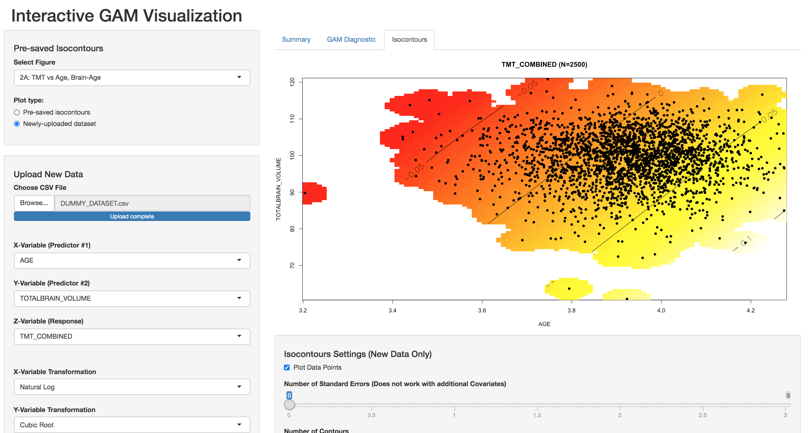

# GAM Visualization
An interactive visualization of GAM models using R Shiny package.

A user will need basic familiarity with the R programming language to run this application.

## Description
Generalized Additive Models (GAMs) offer flexible ways to capture multi-variate relationships. In this interactive visualization, the user can select variables to build an arbitrarily complex GAM, then view the predicted surface plots and isocontour plots for two selected variables.

The intended context of this application is in neuroimaging. A dummy dataset has been supplied for illustrative purposes with the following variables:

* STUDY
* AGE
* SEX
* DIAGNOSIS
* CS1 (Cognitive test performance)
* CS2
* ICV (Intravranial volume)
* TOTALBRAIN_VOLUME

## Main Visualization
The figure under the "Contours" tab offers a view of the relationship between the three selected variables.

## Installation

1. Run install.R to ensure the necessary packages are installed.
2. Copy your dataset into the R/data/ folder so that it will be loaded properly.
3. Update the Column Dictionary in R/column\_dictionary following the guide below:

The values in "KEY\_NAME" are essential variables necessary to run the app like AGE and SEX. The values in "COL\_NAME" are the corresponding columns in your dataset, which may or may not be named equivalently. You should modify this file to adapt to your dataset. Additionally, you can hide columns from appearing in the application if you assign them the value of "REMOVE" in the KEY\_NAME column.

4. Update R/helpers.R to identify the path to your dataset, the default variables selected in the application, and any essential label schemes like the use of "M", "F" to reflect males and females, respectively.

## Questions

Email Ray Pomponio: raymond (dot) pomponio (at) pennmedicine (dot) upenn (dot) edu

